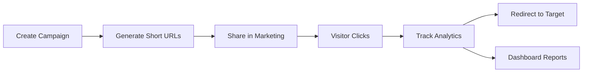

# UTM Shortener - Enterprise URL Management & Analytics

A powerful, self-hosted URL shortening and UTM campaign management solution for Frappe/ERPNext. Track marketing campaigns, analyze traffic sources, and optimize conversions with enterprise-grade analytics.

## 🚀 Key Features

### URL Management
- **Custom Branded Domains**: Use your own domain for short URLs
- **Flexible Short Codes**: Auto-generated or custom aliases
- **Bulk Operations**: Create hundreds of URLs at once
- **QR Code Generation**: Automatic QR codes for every URL
- **URL Expiration**: Set time limits for temporary campaigns

### Campaign Tracking
- **Full UTM Support**: Source, Medium, Campaign, Term, Content
- **Campaign Organization**: Group URLs by marketing campaigns
- **Template System**: Reusable UTM parameter sets
- **Multi-channel Tracking**: Track performance across all channels

### Analytics & Insights
- **Real-time Analytics**: See clicks as they happen
- **Conversion Source Tracking**: Know where your traffic comes from
- **Geographic Analytics**: Track visitor locations
- **Device & Browser Stats**: Understand your audience
- **Campaign ROI**: Measure campaign effectiveness

### Enterprise Features
- **Self-hosted**: Complete control over your data
- **Rate Limiting**: Prevent abuse and spam
- **Permission Control**: Role-based access
- **API Access**: Full REST API for integrations
- **Scheduled Cleanup**: Automatic maintenance

## 📋 Prerequisites

- Frappe/ERPNext v14 or higher
- Python 3.8+
- MariaDB/MySQL
- Redis
- Nginx (for custom domain setup)

## 🛠️ Installation

```bash
# Install the app
bench get-app https://github.com/chinmaybhatk/utm_shortener.git
bench --site your-site-name install-app utm_shortener

# Run migrations
bench --site your-site-name migrate
```

## ⚙️ Quick Setup

### 1. Configure Your Domain

Go to **UTM Shortener Settings** and configure:

```
Short Domain: link.yourdomain.com
Use HTTPS: ✓
Custom Domain Enabled: ✓
Rate Limit per Hour: 100
```

### 2. Create Your First Campaign

```python
# Create a campaign
campaign = frappe.get_doc({
    "doctype": "UTM Campaign",
    "campaign_name": "Product Launch 2024",
    "utm_source": "social",
    "utm_medium": "post",
    "utm_campaign": "product-launch-2024"
}).insert()

# Create a short URL
short_url = frappe.get_doc({
    "doctype": "Short URL",
    "original_url": "https://example.com/new-product",
    "utm_campaign": campaign.name,
    "custom_alias": "new-product"
}).insert()

print(f"Your short URL: {short_url.short_url}")
# Output: https://link.yourdomain.com/s/new-product
```

### 3. Share and Track

Share your short URLs and watch the analytics in real-time!

## 📊 How It Works



## 📚 Documentation

- **[Setup Guide](SETUP_GUIDE.md)** - Detailed setup instructions
- **[Workflow Documentation](docs/WORKFLOW.md)** - Visual workflow diagrams
- **[API Reference](#api-reference)** - Complete API documentation

## 🔧 API Reference

### Authentication
All API calls require authentication using API keys or session tokens.

### Core Endpoints

#### Create UTM Campaign
```python
POST /api/method/utm_shortener.utm_shortener.api.create_utm_campaign
{
    "campaign_name": "Summer Sale",
    "utm_source": "email",
    "utm_medium": "newsletter",
    "utm_campaign": "summer-sale-2024"
}
```

#### Create Short URL
```python
POST /api/method/utm_shortener.utm_shortener.api.create_short_url
{
    "original_url": "https://example.com/page",
    "utm_campaign": "campaign-id",
    "custom_alias": "summer"
}
```

#### Get Analytics
```python
GET /api/method/utm_shortener.utm_shortener.api.get_campaign_analytics
{
    "campaign_id": "campaign-id"
}
```

## 🎯 Use Cases

### Marketing Teams
- Track campaign performance across channels
- A/B test different messaging
- Measure ROI by traffic source

### Sales Teams
- Create personalized links for prospects
- Track engagement with sales materials
- Measure email campaign effectiveness

### Social Media
- Track viral content spread
- Measure influencer campaign impact
- Optimize posting strategies

### Events & Webinars
- Track registration sources
- Measure promotional effectiveness
- Analyze attendee demographics

## 🔒 Security & Privacy

- **Self-hosted**: Your data stays on your servers
- **Permission-based**: Granular access control
- **GDPR Compliant**: Full data ownership and control
- **Rate Limiting**: Built-in abuse prevention
- **Audit Trail**: Complete activity logging

## 📈 Analytics Dashboard

Track comprehensive metrics:
- **Traffic Sources**: Social, Search, Email, Direct
- **Geographic Distribution**: Country-level tracking
- **Device Analytics**: Desktop, Mobile, Tablet
- **Time Analysis**: Peak traffic hours
- **Conversion Tracking**: Source to conversion mapping

## 🤝 Contributing

We welcome contributions! Please see our [Contributing Guide](CONTRIBUTING.md) for details.

1. Fork the repository
2. Create your feature branch (`git checkout -b feature/AmazingFeature`)
3. Commit your changes (`git commit -m 'Add some AmazingFeature'`)
4. Push to the branch (`git push origin feature/AmazingFeature`)
5. Open a Pull Request

## 📝 License

This project is licensed under the MIT License - see the [LICENSE](LICENSE) file for details.

## 🙏 Acknowledgments

- Built on the robust [Frappe Framework](https://frappeframework.com)
- Inspired by modern URL shorteners like Bitly and Rebrandly
- Community contributors and testers

## 📞 Support

- **Documentation**: [Setup Guide](SETUP_GUIDE.md)
- **Issues**: [GitHub Issues](https://github.com/chinmaybhatk/utm_shortener/issues)
- **Discussions**: [GitHub Discussions](https://github.com/chinmaybhatk/utm_shortener/discussions)

## 🌟 Star History

[](https://star-history.com/#chinmaybhatk/utm_shortener&Date)

---

Made with ❤️ for the Frappe/ERPNext community
