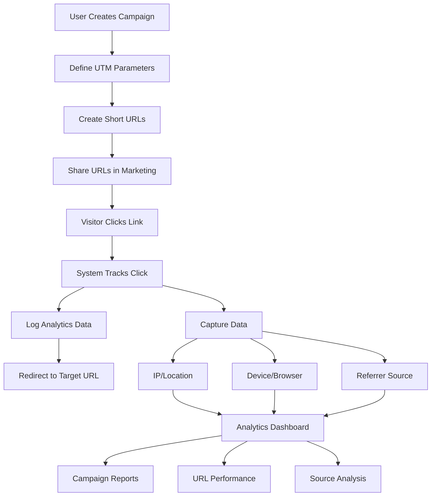
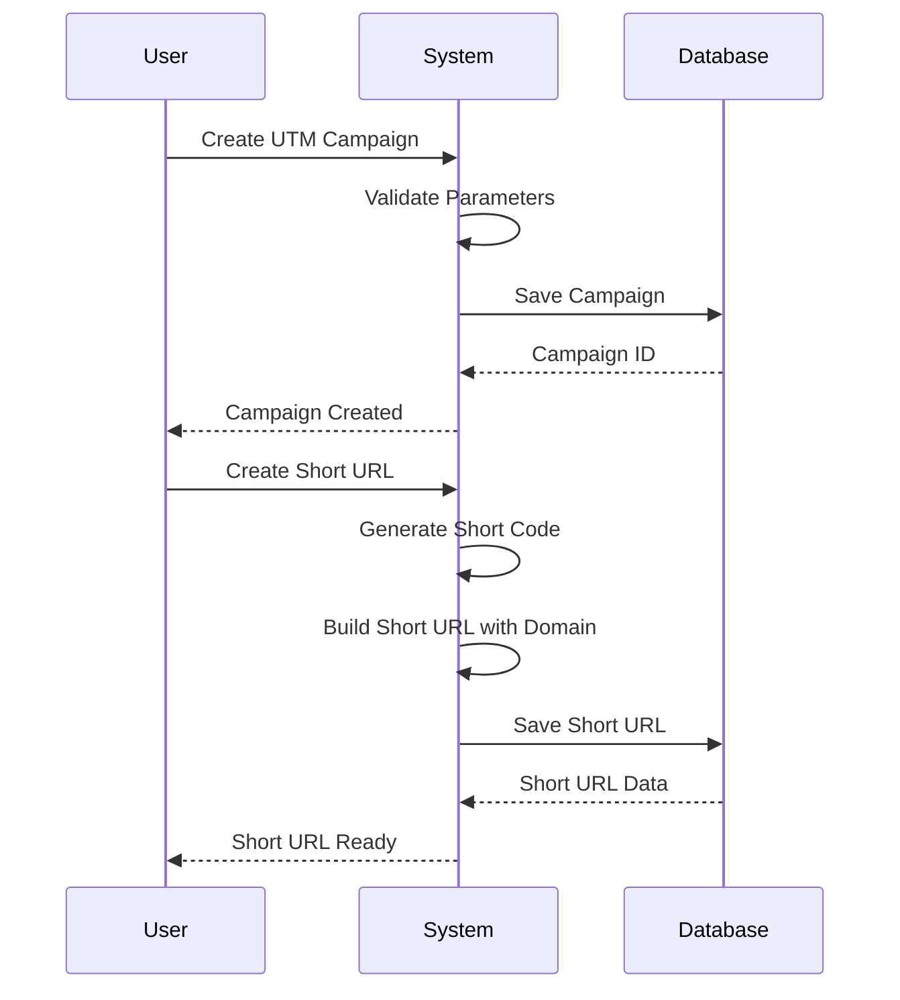
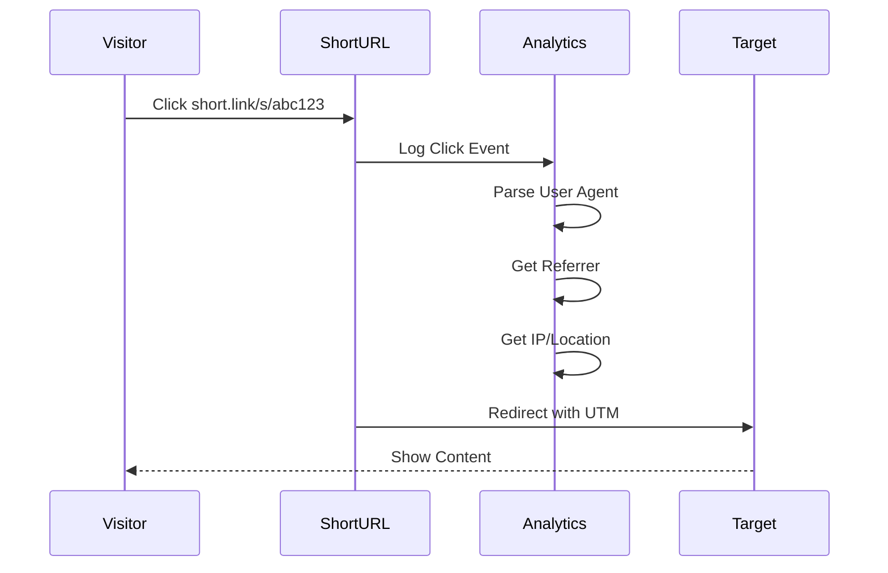

# UTM Shortener Workflow

## How It Works



## Key Components

### 1. Campaign Creation Flow


### 2. Click Tracking Flow


## Data Flow

### Campaign Structure
```
UTM Campaign
├── Campaign Name
├── UTM Parameters
│   ├── utm_source
│   ├── utm_medium
│   ├── utm_campaign
│   ├── utm_term (optional)
│   └── utm_content (optional)
└── Short URLs
    ├── URL 1
    ├── URL 2
    └── URL N
```

### Analytics Collection
```
Click Event
├── Timestamp
├── Short URL Reference
├── Visitor Data
│   ├── IP Address
│   ├── User Agent
│   └── Referrer
└── Parsed Data
    ├── Country
    ├── Device Type
    ├── Browser
    └── Traffic Source
```

## Configuration Options

### Domain Setup Options

#### Option 1: Same Domain
```
Your Site: https://erp.company.com
Short URLs: https://erp.company.com/s/xxxxx
```

#### Option 2: Subdomain
```
Your Site: https://erp.company.com
Short URLs: https://link.company.com/s/xxxxx
```

#### Option 3: Custom Domain
```
Your Site: https://erp.company.com
Short URLs: https://short.link/s/xxxxx
```

## Analytics Dashboard Views

### Campaign Overview
- Total Clicks
- Unique Visitors
- Click-through Rate
- Top Performing URLs
- Geographic Distribution

### Source Analysis
- Traffic Sources Breakdown
- Social Media Performance
- Email Campaign Results
- Direct Traffic Analysis

### Device Analytics
- Desktop vs Mobile
- Browser Distribution
- Operating System Stats

### Time-based Analytics
- Hourly Click Patterns
- Daily Trends
- Campaign Duration Performance
